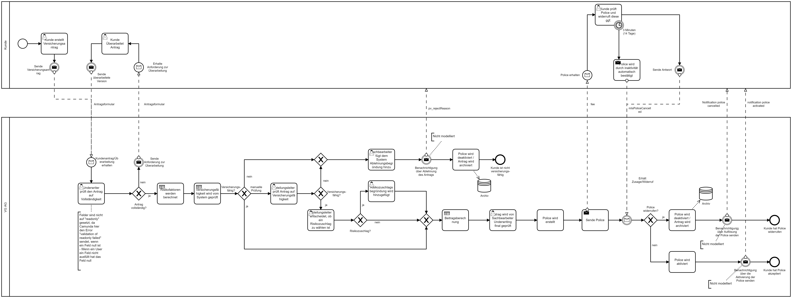
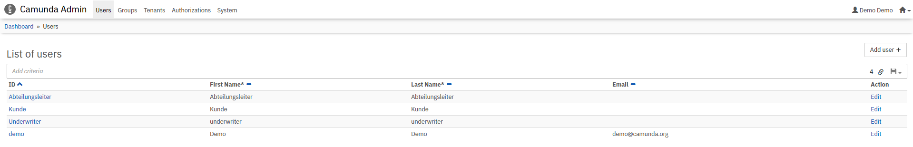

# Camunda BPM Process Application *IM_VGB*
A Process Application for [Camunda BPM](http://docs.camunda.org) for modelling a customers request for an insurance.

This project has been generated by the Maven archetype
[camunda-archetype-servlet-war-7.11.1](http://docs.camunda.org/latest/guides/user-guide/#process-applications-maven-project-templates-archetypes).

## Show me the important parts!
[BPMN Process](src/main/resources/ProzessmodellVersicherungsantrag.bpmn)



## How does it work?
The customer and the VG AG (insurance company) communicate with each other using messages containing
necessary information. Depending on the customers BMI, Age and disease history, the VG AG decides if the customer 
is insurable and if the customer has to pay an additional risk fee. An insurance police is created and send to
the customer. The police activates unless the customer cancels it within a certain time period.

## How to use it?
You start in the customer process "create request for insurance" where you enter the customer details in a form. 
This form is being send to the VG AG which processes the data further. 3 possible end states can be reached:
- The user is ineligible  for the insurance. No police got created.
- The user is eligible for an insurance. A police got created, but the user cancelled it.
- The user is eligible for an insurance. A police got created, and the user did not cancel it. The police is active.

### Installation and Setup
#### Prerequisites
Make sure you have the following set of tools installed:
- Java JDK 1.8+,
- Apache Maven (optional, if not installed you can use embedded Maven inside Eclipse.)
- A modern web browser (recent Firefox, Chrome or Microsoft Edge will work fine)
- Eclipse integrated development environment (IDE)

#### Installation
Follow the installation guide from the [official Camunda Docs](https://docs.camunda.org/get-started/quick-start/install/)
to download the *Camunda BPM Platform* and the *Camunda BPM Modeller*. We recommend using Tomcat for an easy start.

#### Setup
1. This project contains .project and .classpath files that contain all necessary 3rd party imports.
It should be possible to import the project this way. If for any reason the imports are broken, 
read here how to [create a new maven project](https://docs.camunda.org/get-started/quick-start/service-task/#create-a-new-maven-project).
2. To replicate the user base our project contains, start the Camunda Server and navigate to
the Admin Panel > Users and create 3 new Users *Abteilungsleiter, Kunde, Underwriter*. The Users are not part of any groups.
  Your user list should look like this: 


### Deployment to an Application Server
You can build and deploy the process application to an application server.

#### Manually
1. Build the application using:
```bash
mvn clean package
```
2. Copy the *.war file from the `target` directory to the deployment directory
of your application server `tomcat/webapps`.
3. Start the Camunda Modeler and open the [BPMN Process](src/main/resources/ProzessmodellVersicherungsantrag.bpmn).
Deploy the diagram to the Camunda server by clicking on deploy and again deploy on the opening menu.
4.Head over to the Camunda Tasklist and start a new process of "Versicherungsantrag". 
Now, click on "All Tasks" on the left and select the newly generated process. To edit the forms and complete the tasks,
either login as the assignee or claim ownership by first unclaiming the current assignee and then claim the task for yourself.

### Run and Inspect with Tasklist and Cockpit
Once you deployed the application you can run it using
[Camunda Tasklist](http://docs.camunda.org/latest/guides/user-guide/#tasklist)
and inspect it using
[Camunda Cockpit](http://docs.camunda.org/latest/guides/user-guide/#cockpit).

For a faster 1-click (re-)deployment see the alternatives below.

#### Apache Tomcat (using Maven AntRun Plugin)
1. First copy the file `build.properties.example` to `build.properties`
2. Edit the `build.properties` file and put the path to your Tomcat into `deploy.tomcat.dir`.
3. Build and deploy the process application using:
```bash
mvn clean package antrun:run
```

#### Apache Tomcat (using Tomcat Maven Plugin)
1. Create a user in Tomcat with the role `manager-script`.
2. Add the user's credentials to the `tomcat7-maven-plugin` configuration in the [pom.xml](pom.xml) file.
3. Build and deploy the process application using:
```bash
mvn clean tomcat7:deploy
```

Alternatively, you can also copy the `build.properties` file to `${user.home}/.camunda/build.properties`
to have a central configuration that works with all projects generated by the
[Camunda Maven Archetypes](http://docs.camunda.org/latest/guides/user-guide/#process-applications-maven-project-templates-archetypes) e.g. the [examples provided by the Camunda Consulting Team](https://github.com/camunda-consulting/code).

## Environment Restrictions
Built and tested against Camunda BPM version 7.11.0.

## License
[MIT Licence](https://github.com/riggedCoinflip/IM_VG-B/blob/master/LICENSE).
